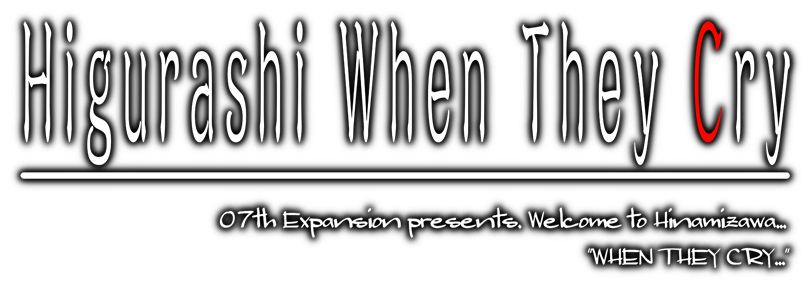

!!! info "Kurulum"
	Kuruluma geçmeden önce bu sayfayı okumanızı öneririz.

	Sol menüden Türkçe yama kurulumuna ulaşabilirsiniz.

!!! info "Türkçe çeviri projesi hakkında"
	Önceliğimiz [Umineko](../umineko/index.md) çevirisini tamamlamak olduğu için Higurashi çevirimiz çok yavaş ilerlemektedir.

***

## Konu

*Keiichi Maebara 1983 yazında sessiz sakin bir köy olan Hinamizawa'ya yeni taşınmıştır ve kısa sürede okul arkadaşları Rena Ryuuguu, Mion Sonozaki, Satoko Houjou ve Rika Furude ile yakın arkadaş olmuştur. Ancak, yaşadıkları bu huzurlu görünen hayatın altında karanlık bir şeyler gizlidir.*

*Köy, her yıl gerçekleştirilen geleneksel festivale hazırlanırken, Keiichi festivali çevreleyen yerel efsaneleri öğrenir. Dehşet içinde, son yıllarda köyde birkaç cinayet ve kaybolma vakası yaşandığını ve bunların hepsinin festivalle ve köyün koruyucu tanrısı Oyashiro-sama ile bağlantılı olduğunu keşfeder. Keiichi yeni arkadaşlarına bu olayları sormaya çalışır, lakin onlar şüphe uyandırıcı bir biçimde sessiz kalırlar ve ona istediği cevapları vermeyi reddederler. Daha tuhaf olaylar meydana geldikçe, arkadaşlarının kendisinden başka neler saklıyor olabileceğini ve hatta onlara güvenip güvenemeyeceğini düşünmeye başlar.*

***

## İlk Chapter (Prolog)

	<iframe src="https://www.youtube.com/embed/WjqutWVgIAQ" frameborder="0" allow="accelerometer; autoplay; clipboard-write; encrypted-media; gyroscope; picture-in-picture; web-share" referrerpolicy="strict-origin-when-cross-origin" allowfullscreen></iframe>

<!-- ## Genel Çeviri İlerlemesi

???+ note "Not"
	Çevirinin ilerlemesini buraya düzenli ve detaylı olarak yansıtmıyoruz. Çevirinin ilerlemesini detaylı olarak incelemek istiyorsanız [buraya](https://github.com/Witch-Love/higurashi-scripting-tr#i%CC%87lerleme) göz atabilirsiniz.

- Ana Hikaye
    - [ ] Chapter 1 (Onikakushi)
    - [ ] Chapter 2 (Watanagashi)
    - [ ] Chapter 3 (Tatarigoroshi)
    - [ ] Chapter 4 (Himatsubushi)
    - [ ] Chapter 5 (Meakashi)
    - [ ] Chapter 6 (Tsumihoroboshi)
    - [ ] Chapter 7 (Minagoroshi)
    - [ ] Chapter 8 (Matsuribayashi)
- Bonus
    - [ ] Chapter 9 (Rei)
    - [ ] Chapter 10 (Hou+) -->