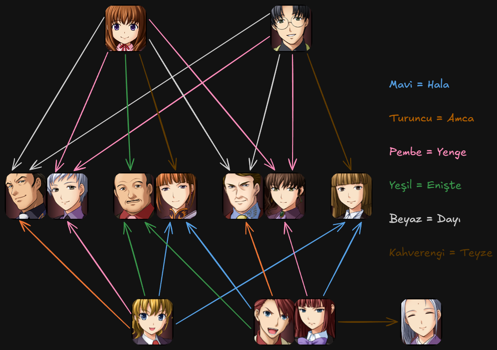

!!! tip "Bilgi"
	Çeviriye katkıda bulunmak, bizimle beraber çeviri yapmak isterseniz bizimle [iletişime](../../contact.md) geçebilirsiniz.

???+ danger "!! SPOILER UYARISI !!"
	Umineko'yu tamamen bitirmediyseniz aşağıdaki terimlerden bazılarını görmeniz (dolaylı olarak varlığını öğrenmiş oluyorsunuz) hikâye üzerindeki muhakemenizi (akıl yürütmenizi) ve tecrübenizi olumsuz olarak etkileyecektir.  
    Bu nedenle buraya yalnızca Umineko'ya gerçekten hakimseniz bakmanızı öneriyoruz.  
    ^^Spoilerlar konusunda lütfen dikkatli olun.^^

***

## Genel Kurallar

1.  **`#!yaml Hitaplar`**  
    * ??? info "Akraba hitapları"
        
    * **Sen ve siz** hitapları biraz kafa karıştırıcı olabiliyor. Akışı bozmamaya özen göstererek alttaki kurallara uymaya çaba sarf edelim.
        * Battler'ın okuyuculara hitabı `-siz` olmalı.
            * Tüm karakterlere hitabı `-sen` olmalı.
        * Ronove'nin Battler'a hitabı `-siz` olmalı.
        * Anlatı genel olarak okuyuculara hitap ettiğinden `-siz` olmalı. Fakat bazı istisnalar var o yüzden akışı bozmamaya özen gösterin.
        * Hizmetkârların Ushiromiya aile bireylerine hitapları `-siz` olmalı. Sık olmasa da bazı istisnalar var.
        * Nanjo'nun Kinzo'ya hitabı `-sen` olmalı.
2.  **`#!yaml İngilizce sözler`**  
    Karakterlerin ingilizce olarak söyledikleri sözler bazı istisnalar hariç ingilizce olarak kalıyor.  
	İngilizce sözler `<>` arasına yazılır. Örneğin: `<Good>`  
	Bazı örnekler:
    * <Happy Halloween\>
    * <Trick-or-treat\>
    * <Good\>
3. **`#!yaml Ses efektleri`**  
    Ses efektlerini çevirme işi biraz zorlu. Karşılaştığınız ses efektlerini komik durmayacak şekilde çevirmeye çalışın. Aklınıza bir şey gelmiyorsa bize danışabilir ya da İngilizce olarak bırakabilir ve atlayabilirsiniz.
    * `*giggle*`  
        Bir tane ise `*kıkırdar*`, çoklu ise `*kıkır*kıkır*kıkır*` şeklinde çeviriyoruz.
    * `*cackle*`  
        Bir tane ise `*kıKIr*`, çoklu ise `*kıKIr*kıKIr*kıKIr*` şeklinde çeviriyoruz. Büyük harfler aynı olmalı, rastgele değil.
4.  **`#!yaml Özel durumlar ve diğer`**
    * Noktalama işaretlerini çok büyük oranda aynı bırakmaya özen gösteriyoruz.
    * Grandfather, Mom, Father ve benzerlerinin çevirilerinin de baş harfleri büyük olmalı.
    * Tekrarlanan kelime cümle başındaysa, kelime büyük harf ile devam etmeli.  
        Örneğin `N-neden...` yerine `N-Neden...` olmalı.
    * Çok önemli değil fakat Battler'ın gülüşlerinin baş harfini düzeltebilirsiniz.  
    `Ihihihihi` yerine `İhihihihi`.
    * Şapkalı a `(â)` yazımlarına dikkat ediyoruz. En çok karşımıza çıkan bazı kelimeler:
        * Hâlâ/Hâlen, Hikâye, Hizmetkâr, İmkân/İmkânsız, İnkâr, Malikâne, Pekâlâ, Rüzgâr
    * Saygı ekleri (ifadeleri) olduğu gibi kalıyor, çevirmiyoruz:
        * Kyrie-san, George-aniki vb.

***

## Karşılıklar

### Sözlük

* Alibi `->` Mazeret
* As you command `->` Emredersiniz
* Apprentice `->` Çırak
* Aunt `->` Özel Durum *`(akraba hitapları kuralına bakın)`*
* Blue Truth `->` Mavi Gerçek
* Boiler Room `->` Kazan Dairesi
* Book of Psalms `->` Mezmurlar Kitabı
* Butler `->` Uşak
* Chapel `->` Kilise
* Circumstantial Evidence `->` Dolaylı Kanıt
* Conference `->` Konferans
* Contract `->` Sözleşme
* Courtroom `->` Mahkeme Salonu
* Culprit `->` Suçlu
* Crest `->` Arma
* Crime Scene `->` Suç Mahalli
* Delusion `->` Kuruntu
* Demon `->` İblis
* Demons' Roulette `->` İblislerin Ruleti
* Demon Stake `->` İblis Kazığı
* Detective Proclamation `->` Dedektiflik Bildirgesi
* Devil `->` Şeytan
* Devil's Proof `->` Şeytan'ın İspatı
* Dining Hall `->` Yemek Salonu
* Disciple `->` Öğrenci
* Entrance Hall `->` Giriş
* Epitaph `->` Kitabe
* Excuse me `->` İzninizle
* Family Head `->` Aile Reisi
* Fragment `->` Kakera *`(kakera olan için)`*
* Furniture `->` Mobilya
* Game Master `->` Oyun Yöneticisi
* GHQ `->` GHQ
* Goat Attendant `->` Keçi Uşağı
* Golden Land `->` Altın Diyar
* Great Demon `->` Yüce İblis
* Grimoire `->` Grimoire *`(aynı)`*
* Gruesome `->` Dehşet verici
* Guesthouse `->` Konukevi
* Guest room `->` Misafir odası
* Head's Ring `->` Aile Reisi Yüzüğü
* Hempel's Raven `->` Hempel'in Kuzgunu
* Horrible `->` Korkunç
* Incinerator `->` Çöp Fırını
* Locked Room `->` Kilitli Oda
* Logic Error `->` Mantık Hatası
* Lounge `->` Bekleme Salonu
* Love `->` Aşk *`(büyüye yönelik söylenmiyorsa duruma bağlı)`*
* Madam `->` Madam *`(aynı)`*
* Magic `->` Büyü
* Manifest `->` Tezahür Etmek
* Mansion `->` Malikâne / Köşk *`(Kuwadorian'a yönelik ise)`*
* Master `->` Efendi / Usta *`(Kinzo / Virgilia)`*
* Master Key `->` Master Anahtar
* Milady `->` Leydim
* Mistress `->` Metres
* Narrative `->` Anlatı
* North Wind and the Sun `->` Güneş ve Kuzey Rüzgârı
* Objection `->` İtiraz
* Old Testament `->` Eski Ahit
* Parlor `->` Salon
* Piece `->` Taş *`(satranç taşı olan için)`*
* Portrait `->` Portre
* Predecessor `->` Selef
* Puzzle `->` Bilmece
* Reasoning `->` Muhakeme
* Red Truth `->` Kırmızı Gerçek
* Register `->` Nüfus
* Repetition Request `->` Tekrarla
* Resign `->` Pes Etmek
* Rifle `->` Tüfek
* Ritual `->` Ritüel
* Rose Garden `->` Gül Bahçesi
* Servant `->` Hizmetkâr
* Servant Room `->` Hizmetkâr Odası *`(Malikâne içi)`*
* Servants' Quarters `->` Hizmetkâr Koğuşu *`(Konukevi içi)`*
* Seven Stakes of Purgatory `->` Araf'ın Yedi Kazığı
* Shutter `->` Kepenk
* Stalemate `->` Pat
* Storehouse `->` Ambar
* Study `->` Çalışma Odası
* Successor `->` Halef
* Trick `->` Numara / Yöntem *`(kullanımına bağlı olarak farklılık var)`*
* Trick or Treat `->` Şaka mı Şeker mi
* Uncle `->` Özel Durum *`(akraba hitapları kuralına bakın)`*
* Ushiromiya Head Family `->` Ushiromiya Baş Ailesi
* Vessel `->` Beden
* Voyager `->` Gezgin
* Western Envelope `->` Batı Tarzı Zarf
* Witch Legend Serial Murder Case `->` Cadı'nın Seri Cinayet Efsanesi
* Wolves and Sheep Puzzle `->` Kurtlar ve Koyunlar Bulmacası

### Cadıların Ünvanları

* Endless Witch `->` Sonsuz Cadı
* Golden Witch `->` Altın Cadı
* Witch of Certainty `->` Kesinliğin Cadısı
* Witch of Miracles `->` Mucizelerin Cadısı
* Witch of Origins `->` Kökenlerin Cadısı
* Witch of Resurrection `->` Dirilişin Cadısı
* Witch of Theatergoing, Drama, and Spectating `->` Tiyatronun, Dramanın ve Seyirciliğin Cadısı
* Witch of Theatergoing `->` Tiyatronun Cadısı
* Witch of Truth `->` Gerçeklerin Cadısı

### Diğer

|İngilizcesi|Türkçe çevirisi|
|:---:|:---:|
|Old Testament's Book of Psalms, Psalm x, verses y and z|Eski Ahit'in Mezmurlar Kitabı, x. Mezmur, ayet y ve z|
|Come, arise, forgive the sin, one of the seven stakes of Purgatory, lust!!!|Gel, yüksel, günahları affet, Araf'ın Yedi Kazığı'ndan, şehvet!!!|
|Come, try closing your eyes. And try to remember. What form did you have? It was surely a very, very beautiful form. Please, show me that form one more time...|Gel, gözlerini kapatmayı dene. Ve hatırlamaya çalış. Senin nasıl bir formun vardı? Eminim çok, çok güzel bir formdu. Lütfen bana o formu bir kez daha göster...|
|All it takes is the presence of x, and a deduction like this becomes trivial for Furudo Erika. Your thoughts, ladies and gentlemen?|Sadece x'in varlığı bile, Furudo Erika için böyle bir çıkarımın sıradan hale gelmesi için yeterli. Görüşleriniz, bayanlar ve baylar?|
|I am one yet many|Ben biriyim ve de birçoğuyum|
|It's no good, it's no goddamn good|Bu hiç iyi değil, hiç de iyi değil|
