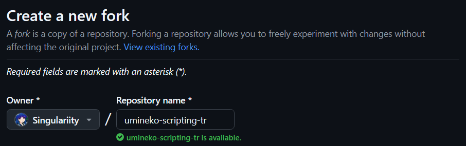

In this tutorial, we will be talking about how you can create a new language setting for Umineko Project.

???+ info "Use your own language code!"
	In the tutorial, we used our own language code `#!yaml tr`, which is for Turkish. Don't forget to ^^use your own language code^^ instead.

	You can check [language codes](https://en.wikipedia.org/wiki/List_of_ISO_639_language_codes) page for other codes.

## 1. Forking the Repository

First off, start with [forking](https://github.com/umineko-project/umineko-scripting/fork) the original `umineko-scripting` repository. (1)
{ .annotate }

1.  By this, you're basically creating a copy from the original repository. After forking, you will be able to make your own changes in your forked repository.

Use your own language code when naming.

{ modal=true }

