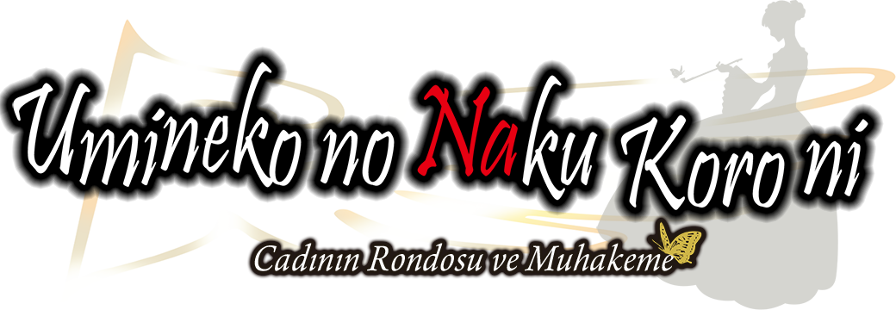

!!! info "Kurulum"
	Kuruluma geçmeden önce bu sayfayı okumanızı öneririz.

	Sol menüden Umineko Project ve Türkçe yama kurulumlarına ulaşabilirsiniz.

***

## Nedir bu Umineko?

*Umineko no Naku Koro ni, absürt derecede zengin olan Ushiromiya ailesinin sahip olduğu Rokkenjima adlı adada geçiyor. Tüm aile, her yıl geleneksel olarak her bireyin mevcut mali durumlarının tartışıldığı bir aile konferansı için adada toplanmaktadır. Aile reisinin sağlık durumunun kötü olması nedeniyle, bu yıl aile reisinin mirası ve mirasın nasıl dağıtılacağı konusu gündeme gelir.*

*Ancak aile, miras dağıtımının bu yılki aile konferansındaki endişelerinin en küçüğü olduğunun farkında değildir. Ebedi dostu ve doktoru tarafından sonunun yaklaştığı söylenen Kinzo (aile reisi), hayatının gerçek aşkı Altın Cadı Beatrice'i son bir kez görmek için yanıp tutuşmaktadır. Hayatının ilerleyen yıllarında kendini kara büyüye kaptıran Kinzo, ailesinin Rokkenjima'ya varışıyla birlikte Beatrice'i yeniden diriltmek için bir ritüel düzenler. Kısa süre sonra şiddetli bir tayfun tüm aileyi adaya hapseder ve adadaki on sekiz kişiyi fantezi ile gerçeklik arasında ölümcül bir mücadelede yaşamaları için savaşmaya zorlayan bir dizi gizemli cinayetler baş gösterir.*

***

## Eser Hakkında

### Başlamadan Önce

Daha iyi bir deneyim için Umineko'ya başlamadan önce Higurashi görsel romanını oynamanızı veya animesini izlemenizi şiddetle tavsiye ederiz. Aynı evrenin içinde yer almalarına rağmen, iki eser de nispeten birbirinden bağımsız olsalar da evrenle ilgili önemli referanslar içerirler.

### Eserin Yapısı

Hikâye, soru ve cevap arkları olarak 2 temel kısımdan oluşur. `(Question Arcs & Answer Arcs)`  

Oyunun kendisi neredeyse tamamen lineer bir hikâye olsa da, bu arkanıza yaslanıp rahatlayabileceğiniz anlamına gelmiyor. Sizden `(yani okuyucudan)` beklenen, soru arkları boyunca gizemleri çözmenizdir. Ortaya bir gizem çıktığında, daima Battler'dan bir adım önde olmaya çalışmalı ve Rokkenjima'nın çeşitli gizemlerini çözmeye odaklanmalısınız.

Bu eserin yazar ile okuyucu arasında bir mücadele olduğunu unutmayın. :)

***

## İlk Chapter (Prolog)

	<iframe style="position: absolute; top: 0; left: 0; width: 100%; height: 100%;" src="https://www.youtube.com/embed/XWQ8DqlesdU" frameborder="0" allow="accelerometer; autoplay; clipboard-write; encrypted-media; gyroscope; picture-in-picture; web-share" referrerpolicy="strict-origin-when-cross-origin" allowfullscreen></iframe>

<!-- ## Genel Çeviri İlerlemesi

???+ note "Not"
	Çevirinin ilerlemesini buraya düzenli ve detaylı olarak yansıtmıyoruz. Çevirinin ilerlemesini detaylı olarak incelemek istiyorsanız [buraya](https://github.com/Witch-Love/umineko-scripting-tr#i%CC%87lerleme) göz atabilirsiniz.

- [x] Episode 1
- [x] Episode 2
- [ ] Episode 3
- [ ] Episode 4
- [ ] Episode 5
- [ ] Episode 6
- [ ] Episode 7
- [ ] Episode 8 -->