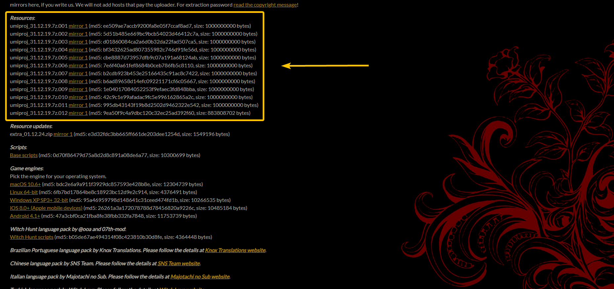
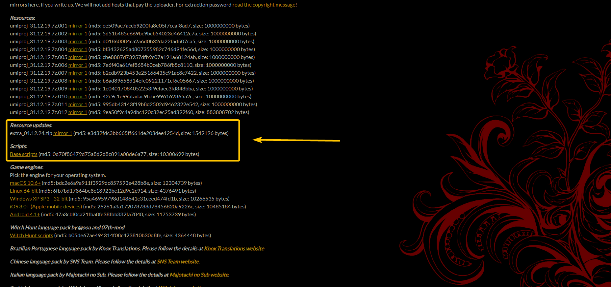
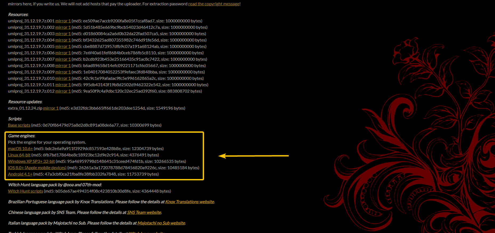
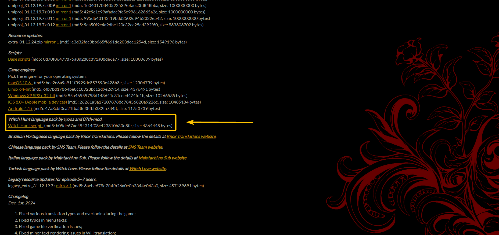

# Umineko Project Kurulumu

!!! info "Bilgi"
	Bu sayfa [Umineko Project](https://umineko-project.org/) kurulumunu içermektedir.  
	Umineko Project kurulumunu çoktan yaptıysanız bu sayfayı atlayıp [2. adıma](tr-installation.md) geçebilirsiniz.

???+ warning "Umineko Project: Önemli Telif Hakkı Uyarısı"
	Alttaki metin **Umineko Project**'in sitesinde bulunan [Copyright message](https://umineko-project.org/en/copyright-message/) sayfasından alınmıştır.

	Bu açıklamayı kabul ediyorsanız rehberi okumaya devam edebilirsiniz.

	```{ .yaml title="Copyright message" .no-copy }
	This game may violate various copyrights of Ryukishi07, Alchemist, artists, musicians, voice actors, translators, and more.
	
	It is not our intent to financially (or otherwise) harm any of these people or companies. It is simply not financially possible for us to obtain permission to legally distribute this game with all its features, and we opted for English and Russian versions of Umineko PS3 to exist in this state instead of not at all.

	We ask all our users to support these people by buying the products that made this game possible: the PC release of Umineko no Naku Koro ni EP4, and the PS3 release of Umineko no Naku Koro ni Rondo — even if you do not own a PS3.

	Usage of this game is prohibited if you do not own either one of these two games.

	You are forbidden to redistribute the intact game without this copyright message and a link to Umineko Project website. You are forbidden to redistribute the game with any modifications unless officially allowed by Umineko Project.

	Disclaimer:
	This software is provided “as is”, without warranty of any kind, expressed or implied. In no event shall the authors be liable for any damages or other issues caused by the software, their website or anything related. The software is provided for private, non-commercial use only. For use outside Japan only.

	The password to extract the game archive can be constructed if you own the PC and PS3 games, as follows:

	1. Find the large bold numbers on the back cover of the PS3 game manual, and write them down without hyphens.
	2. Look up the number before “KB” at the bottom of page 4 of the PS3 game manual, and append it to the end of what you already wrote.
	3. Find the “うみねこのなく頃に.exe” file of the PC game, and append its size in bytes (not “size on disk”) to the end.
	4. Finally, find the “nscript.dat” file of the PC game, and append its size in bytes (not “size on disk”) to the end.
	
	At this point you will have a 27-digit passphrase you can use to unpack the archives.
	```

!!! info "Kurulum hakkında"
	Kurulum işlemleri kafa karıştırıcı görünüyor olsa da aslında oldukça basit. Adımların tamamı yalnızca indirmiş olduğunuz arşiv dosyalarını çıkartıp tek bir klasöre toplamaktan ibaret.

	Tüm adımları dikkatlice takip etmeye özen gösterirseniz bir sorun yaşamadan kurulumu tamamlayabileceksiniz.

Windows kurulumu haricinde bir rehberimiz bulunmuyor fakat android için bizim rehberimiz olmayan [Android kurulum](https://uminekoprojectandroid.neocities.org) rehberine göz atabilirsiniz.

***

## Başlangıç

Her şeyden önce bilgisayarınızın herhangi bir yerinde yeni bir klasör oluşturun. İsmi önemli değil, istediğiniz ismi koyabilirsiniz. İndirdiğiniz dosyaların içeriklerini bu klasörde toplayacak ve oyunu bu klasörden başlatacaksınız.

Klasörü oluşturduktan sonra indirme kısımlarına geçiyoruz. İndirme işlemlerine başlamak için Umineko Project'in sitesinde bulunan [Downloads](https://umineko-project.org/en/downloads/) sayfasını açalım ve her adımın resimlerinde gösterilen şekilde dosyaları indirelim. Hangi klasöre indirdiğinizin bir önemi yok. Varsayılan **İndirilenler** klasörünüzde bulunabilirler.

***

## 1. Resources Dosyaları

Şimdi burada önemli bir kısım var. Burada indireceğiniz 12 dosyanın hepsi aslında tek bir dosyanın bölünmüş hali. Yani, buradaki tüm dosyaları indirene kadar bu dosyaları (yani dosyayı) açamazsınız.



???+ announcement "İndirme alternatifleri hakkında (mirrors)"
	Umineko Project yakın zamana kadar 3 farklı indirme bağlantısı sunuyorken, sitede şu an yalnızca Mega bulunuyor. Mega pek kullanışlı olmadığı için sorun yaşamamanız adına ekstra indirme seçenekleri oluşturduk.  
	Bu bağlantılar Umineko Project'in indirmeler sayfasına eklenene dek burada paylaşıyor olacağız.

	Dosyalar Umineko Project dosyalarının birebir aynılarıdır.  
	İndirdikten sonra [bu siteden](https://emn178.github.io/online-tools/md5_checksum.html) **MD5** kontrolü yapabilirsiniz.

	| Dosya | Pixeldrain | Google Drive | MD5 |
	| ----- | ---------- | ------------ | --- |
	| `umiproj_31.12.19.7z.001` | [mirror 2](https://pixeldrain.com/u/Des9bpAG) | [mirror 3](https://drive.google.com/file/d/107Y1NVZJCv6BaEmKc6lZTRJhpUhiqhG9) | `#!css ee509ae7accb9200fa8e05f7ccaf8ad7` |
	| `umiproj_31.12.19.7z.002` | [mirror 2](https://pixeldrain.com/u/2tFZ7LDQ) | [mirror 3](https://drive.google.com/file/d/1PhEGXzdqVJSnHNhp3CWN7wympnM-Yf_g) | `#!css 5d51b485e669bc9bcb54023d46412c7a` |
	| `umiproj_31.12.19.7z.003` | [mirror 2](https://pixeldrain.com/u/vsiuq4wZ) | [mirror 3](https://drive.google.com/file/d/1wW1CHqQE65MoqHJ2DEkAUkb_1cALWvX9) | `#!css d01860084ca2a6d0b32da22fad507ca5` |
	| `umiproj_31.12.19.7z.004` | [mirror 2](https://pixeldrain.com/u/2ko6GwZu) | [mirror 3](https://drive.google.com/file/d/1X9kqaM5wbMtecdDqz1H_COLCsGCUuEUE) | `#!css bf3432625ad807355982c746d91fe56d` |
	| `umiproj_31.12.19.7z.005` | [mirror 2](https://pixeldrain.com/u/fHeFsXcF) | [mirror 3](https://drive.google.com/file/d/1GyJKuK_CpmTTrMFQ0UAdsooU0VNI67Yx) | `#!css cbe8887d73957dfb9c07a191a68124ab` |
	| `umiproj_31.12.19.7z.006` | [mirror 2](https://pixeldrain.com/u/gcaytyoP) | [mirror 3](https://drive.google.com/file/d/1HUFVC-P3SuMtrd10oDWGGnTOrx9wFqv0) | `#!css 7e6f40a61fef8684b0ceb786fb5c8110` |
	| `umiproj_31.12.19.7z.007` | [mirror 2](https://pixeldrain.com/u/xh5m7f16) | [mirror 3](https://drive.google.com/file/d/1BOZ5GI-_nL68g92KnDkYU-t5Jn9FfIBV) | `#!css b2cdb923b453e25166435c91ac8c7422` |
	| `umiproj_31.12.19.7z.008` | [mirror 2](https://pixeldrain.com/u/8x2b8p5c) | [mirror 3](https://drive.google.com/file/d/1zxvUfpJBWB8zeE8TLV2KIPHIb0en9XKY) | `#!css b6ad89658d14efc09221171cf6c05667` |
	| `umiproj_31.12.19.7z.009` | [mirror 2](https://pixeldrain.com/u/v44MZRAx) | [mirror 3](https://drive.google.com/file/d/1ZFYh7Je2geRa8pl8TBfD4RtzPm48puyS) | `#!css 1e04017084052253f9efaec3fd848bba` |
	| `umiproj_31.12.19.7z.010` | [mirror 2](https://pixeldrain.com/u/UF16f9nY) | [mirror 3](https://drive.google.com/file/d/1zD9CkaBegaXmVr-x0A-BoaFJBaRfFGjd) | `#!css 42c9c1e99afadac9fc5e996162865a2c` |
	| `umiproj_31.12.19.7z.011` | [mirror 2](https://pixeldrain.com/u/7JvADGPr) | [mirror 3](https://drive.google.com/file/d/1sqnUwn9sKI6FxYIypksGQm0mWwn1hehc) | `#!css 995db43143f19b8d2502d9462322e542` |
	| `umiproj_31.12.19.7z.012` | [mirror 2](https://pixeldrain.com/u/KMc6ckxz) | [mirror 3](https://drive.google.com/file/d/1zQQtbqzTgdoQ1CKpG615CV6ldqQxilRW) | `#!css 9ea50f9c4a9dbc120c32ec25ad392f60` |

^^SADECE AMA SADECE^^ bu 12 dosyanın hepsinin indirmesi tamamlandıktan ve hepsini aynı klasörde topladıktan sonra `umiproj_31.12.19.7z.001` adlı dosyayı açabileceksiniz.

Bu 12 dosyanın tamamı indirildikten sonra yapmanız gereken şey [WinRAR](https://www.win-rar.com/download.html) gibi bir arşiv programı kullanarak `umiproj_31.12.19.7z.001` adlı dosyayı açmaktır.

??? warning "Arşiv Şifresi"
	Sayfanın başında bulunan telif hakkı uyarısını kabul ettiğinizi varsayıyoruz.

	```sh
	035646750436634546568555050
	```

Arşiv dosyasını açtıktan sonra içindeki tüm dosyaları önceden oluşturmuş olduğunuz klasöre çıkartın. Bu adım neredeyse oyunun tüm dosyalarını içerdiğinden bilgisayarınızın hızına bağlı olarak biraz zaman alacaktır.

Çıkarma işlemi tamamlandıktan sonra sıradaki adıma geçebilirsiniz.

***

## 2. Güncelleme ve Script Dosyaları

Bu adım oldukça basit. Güncelleme ve script dosyalarının ikisini de indirin ve arşivleri aynı şekilde klasörünüze çıkartın.



***

## 3. Oyun Motoru Seçimi

Bu adım da oldukça basit. Kendi işletim sisteminize uygun olanı seçip indirin ve klasörünüze çıkartın.

!!! note "Windows"
	Windows kullananlar **Windows XP 32-bit** yazdığına aldırış etmesinler. Bunu indirmeniz gerekiyor.



***

## 4. Witch-Hunt İngilizce Çevirisi (Opsiyonel)

Bu adım oyunu İngilizce oynamayı düşünenler içindir. İngilizce oynamayı düşünmüyorsanız bu adımı atlayın.

İngilizce oynamak isteyip "acaba tamamen anlar mıyım", "ya anlamazsam?" şeklinde düşünceleriniz var ise, Witch-Hunt ekibinin İngilizce çevirisini deneyebilirsiniz. Basitçe özetlemek gerekirse, metinlerin anlamını bozmadan daha sade bir İngilizce kullanılmış bir çeviridir.

Önceki adımlarla aynı şekilde indirin ve klasörünüze çıkartın.

!!! note "Not"
	Oyunu açtıktan sonra dili **Witch-Hunt** olarak ayarlamayı unutmayın. Oyuna farklı bir dil seçeneği olarak ekleniyor.



***

!!! success "Kurulum tamamlandı!"
	Bu kadar basit.  
	Son adımla beraber Umineko Project kurulumu tamamlandı. **`onscripter-ru.exe`** dosyasından oyunu açabilirsiniz.  
	Bazı bilgisayarlarda sorun yaşandığı için ^^yönetici olarak^^ çalıştırmanızı öneririz.

	Türkçe yamayı kurmak için [2. adıma](tr-installation.md) geçebilirsiniz.