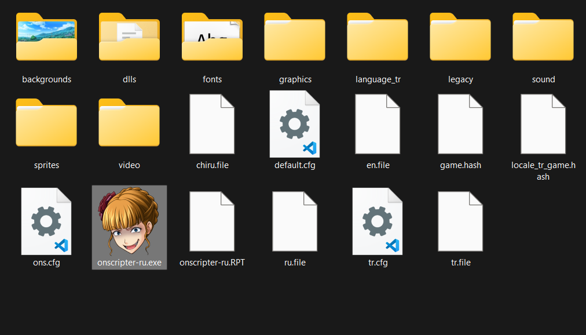

# Türkçe Yama Kurulumu
	
!!! info "Bilgi"
	Henüz [Umineko Project](https://umineko-project.org/en/) kurmadıysanız öncelikle [1. adıma](installation.md) dönüp kurunuz.

--8<-- "faq/steam_support.md"

--8<-- "faq/tr_patch_update.md"

***

## Türkçe Dosyalar

Aşağıda bulunan Türkçe dosyaların ikisini de bilgisayarınıza indirin ve ikisini de **Umineko Project**'in kurulu olduğu klasörünüze çıkartın.

[:fontawesome-solid-download: Türkçe Script](https://github.com/Witch-Love/umineko-scripting-tr/releases/latest/download/umineko-tr-scripts.zip){ .md-button .md-button--primary }
[:fontawesome-solid-download: Türkçe Grafikler](https://github.com/Witch-Love/umineko-scripting-tr-files/releases/latest/download/umineko-tr-files.zip){ .md-button .md-button--primary }

***

!!! success "Kurulum tamamlandı!"
	Türkçe kurulumu bu kadar basit. Kurulum tamamlandıktan sonra klasörünüz resimdekine benzer görünmeli. Eğer ekstra bir klasör bulunuyorsa ya da eksiklikler varsa kurulum esnasında bir şeyleri hatalı yapmış olma ihtimaliniz yüksek. Bir hata almanız durumunda kurulum adımlarını tekrar gözden geçirmenizi öneririz.

	Oyunu açtıktan sonra oyun dilini ==Witch Love== olarak ayarladığınızda oyununuz Türkçe diline geçiş yapacaktır.  
	İyi okumalar!

